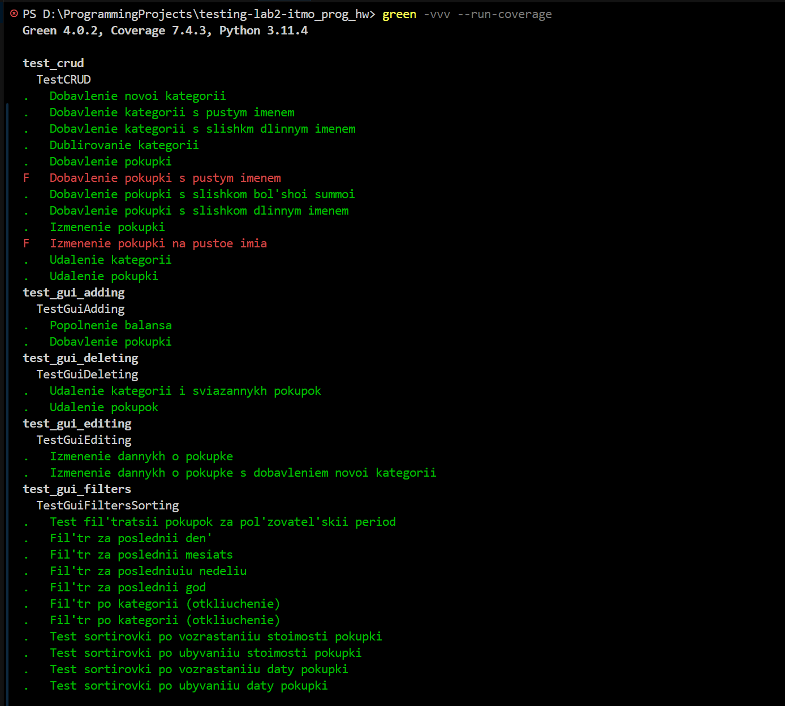
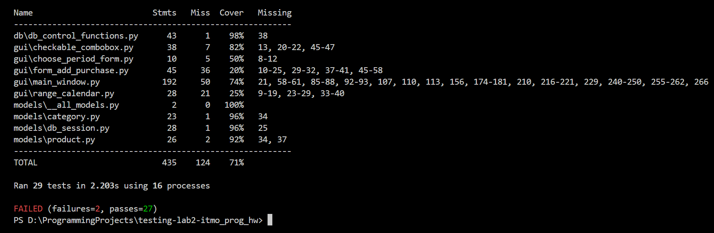

Работы выполнил: Стафеев Иван Алексееич (https://t.me/st_affeev), группа K3321

Проект: https://github.com/staffeev/itmo_prog_hw

Форк проекта с тестами: https://github.com/staffeev/testing-lab2-itmo_prog_hw

### Анализ функциональности проекта

Для интеграционного тестирования был выбран учебный проект, который бы создан в рамках дисциплины по программированию на Python на первом курсе. Он представляет из себя трекер покупок с GUI-интерйфейсом и базой данных для хранения информации о покупках. В программе реалзованы следующие функции: 1) добавление покупки с указанием названия, даты покупки, стоимости и категории; 2) изменение данных конкретной покупки; 3) удаление выбранных покупок; 4) создание и удаление категорий покупок; 5) пополнение баланса; 6) просмотр добавленных покупок; 7) сортировка покупок по дате и по цене и фильтрация по категориям и по периоду.

Функционал программы разбит на следующие блоки:

- `db/purchases.db` - база данных с таблицами `category` и `purchase`.
- `db/control_functions.py` - CRUD-функции, оперирующие с базой данных, которые используются затем в логике программы
- `gui/` - папка с классами окон GUI-интерфейса программы, написанные на библиотеке PyQt5
- `models/db_sessionpy` - файл с функциями для инициализации и настройки SQLAlchemy для работы с SQLite
- `models/category.py` - ORM-модель для категории покупки
- `models/product.py` - ORM-модель для покупки

### Написание тестов

#### 0. Подготовка к тестированию (`test_setup.py`)

Во-первых, определимсся с библиотекой для тестирования. Естестввенным решением сначала казался `pytest`, однако тестирвание GUI на PyQt на моем устройстве при помощи библиотеки `pytest-qt` оказалось не выполнить в силу ошибок с DLL-файлами. После n-го количество попыток исправить ошибку было принято решение написать тесты на `unittest`, во-первых, чтобы не возиться с проблемой, которая не является острой на данный момент, а во-вторых, чтобы попробовать и другой инструмент, кроме `pytest`, который использовался в лабораторной работе №1.

Во-вторых, так как и бизнес-логика программы, и GUI тесно связаны с базой данных, было решено для всех тестов создать миксин-класс, который предоставляет общий setup и подготавливает тестовое окружение для всех тестов.

```python
class TestSetupMixin(unittest.TestCase):
    TEST_DB = ":memory:"

    @classmethod
    def setUpClass(cls):
        cls._patch_question = mock.patch.object(QMessageBox, "question", return_value=QMessageBox.Yes)
        cls._patch_critical = mock.patch.object(QMessageBox, "critical", return_value=None)
        cls._patch_question.start()
        cls._patch_critical.start()

        cls._patch_qt = mock.patch("PyQt5.QtCore.QDateTime.currentDateTime", 
                                   return_value=QDateTime(datetime(2025, 10, 20, 0, 0, 0)))
        cls._patch_qt.start()

    @classmethod
    def tearDownClass(cls):
        cls._patch_question.stop()
        cls._patch_critical.stop()

    def setUp(self):
        db_session.global_init(self.TEST_DB)
        self.engine = db_session.create_session().bind
        db_session.SqlAlchemyBase.metadata.create_all(self.engine)
        self.window = MoneyControlApp(self.TEST_DB)

    def tearDown(self):
        self.window.session.close()
        self.window.close()
        db_session.SqlAlchemyBase.metadata.drop_all(bind=self.window.session.bind)
```

В этом классе происходит инициализация im-memory базы данных, а также мок текущей даты в PyQt и мок диалоговых окон PyQt, чтобы они не перехватывали поток событий. В методах `tearDownClass` и `tearDown` происходит отключение моков и закрытие сессии БД. От этого класса будут наследоваться все дальнейшие классы, содержащие тесты.

Общая логика работы отдельного теста заключается в следующем: создание приложение PyQt → инициализация in-memory БД и моки → проведение теста → отлючение моков и завершение сессии БД → закрытие приложения PyQt.

#### 1. CRUD-функции к БД (`test_crud.py`)

Первоначально были написаны тесты для проверки работоспособности CRUD-функций к БД. В этом модуле тестируется взаимодействие SqlAlchemy ORM ↔ База данных. Для тестов CRUD-функций создан класс `TestCRUD(TestSetupMixin)`. Он содержит тесты:

- операции над категориями покупок:

```python
def test_add_category(self):
    """Добавление новой категории"""
    cat = add_category(self.window.session, "Транспорт")
    self.assertIn(cat, get_categories(self.window.session))

def test_add_category_empty_name(self):
    """Добавление категории с пустым именем"""
    with self.assertRaises(Exception):
        add_category(self.window.session, "")

def test_add_category_long_name(self):
    """Добавление категории с слишкм длинным именем"""
    with self.assertRaises(Exception):
        add_category(self.window.session, "A" * 1001)

def test_add_category_nonunique_name(self):
    """Дублирование категории"""
    cat_name = "Категория"
    add_category(self.window.session, cat_name)
    with self.assertRaises(Exception):
        add_category(self.window.session, cat_name)

def test_delete_category(self):
    """Удаление категории"""
    cat_name = "Продукты"
    add_category(self.window.session, cat_name)
    delete_category_by_name(self.window.session, cat_name)
    self.assertTrue(not any(c.name == cat_name for c in get_categories(self.window.session)))
```

Происходит проверка создания новой категории, категории без имени (создание которой должно сопровождаться ошибкой в силу наложенных на столбец таблицы БД правил), категории с неуникальным именем (тоже правила столбца), а также категории с слишком длинным именем (это правило было определено на этапе требований к системе и реализуется путем валидации в ORM-модели) и тест удаления категории.

- операции над покупками:

```python
def test_add_purchase(self):
    """Добавление покупки"""
    cat_name = "Техника"
    cat = add_category(self.window.session, cat_name)
    purchase = add_purchase(self.window.session, "Ноутбук", 30000, datetime(2025, 10, 15), cat)
    self.assertIn(purchase, get_products(self.window.session))
    self.assertTrue(any(c.name == cat_name for c in get_categories(self.window.session)))

def test_add_purchase_empty_name(self):
    """Добавление покупки с пустым именем"""
    cat = add_category(self.window.session, "Категория")
    with self.assertRaises(Exception):
        add_purchase(self.window.session, "", 30000, datetime(2025, 10, 15), cat)

def test_add_purchase_long_name(self):
    """Добавление покупки с слишком длинным именем"""
    cat = add_category(self.window.session, "Категория")
    with self.assertRaises(Exception):
        add_purchase(self.window.session, "A" * 1001, 30000, datetime(2025, 10, 15), cat)

def test_add_purchase_large_cost(self):
    """Добавление покупки с слишком большой суммой"""
    cat = add_category(self.window.session, "Категория")
    with self.assertRaises(Exception):
        add_purchase(self.window.session, "", 10 ** 9 + 7, datetime(2025, 10, 15), cat)

def test_delete_purchase(self):
    """Удаление покупки"""
    cat_name = "Медицина"
    cat = add_category(self.window.session, cat_name)
    purchase = add_purchase(self.window.session, "Анализы", 7000, datetime(2025, 10, 15), cat)
    delete_purcahses(self.window.session, [purchase.id])
    self.assertTrue(purchase not in get_products(self.window.session))
```

Здесь тестируется создание покупки, а также граничные случаи, аналогичные категориям покупок (плюс покупки с слишком большой суммой), и удаление покупки

- операции изменения покупок

```python
def test_change_purchase(self):
    """Изменение покупки"""
    from datetime import datetime

    cat_name = "Образование"
    cat = add_category(self.window.session, cat_name)
    p = add_purchase(self.window.session, "ДПО от Яндекса", 150000, datetime(2025, 10, 15), cat)
    p.name = "ДПО от Альфа-банка"
    p.date = datetime(2025, 10, 15, 0, 0)
    p.cost = 135000
    self.window.session.commit()

    updated = self.window.session.query(p.__class__).filter_by(id=p.id).first()
    self.assertEqual(updated.name, "ДПО от Альфа-банка")
    self.assertEqual(updated.date, datetime(2025, 10, 15, 0, 0))
    self.assertEqual(updated.cost, 135000)

def test_change_purchase_empty_name(self):
    """Изменение покупки на пустое имя"""
    cat = add_category(self.window.session, "Категория")
    p = add_purchase(self.window.session, "Товар", 10000, datetime(2025, 10, 15), cat)
    p.name = ""
    with self.assertRaises(Exception):
        self.window.session.commit()
```

В этих двух методах тестируется изменение данных о покупке, также с учетом сценария, когда пользователь задает пустую строку в качестве нового имени покупки.

#### 2. Добавление покупок (`test_gui_adding.py`)

Для тестирования взаимодействия GUI ↔ База данных в разрезе добавления покупок был написан класс `TestGuiAdding(TestSetupMixin)`. Он содержит отдельный метод для пополнения баланса (в бизнес-логике пополнения задуманы как траты с отрицательной стоимостью), в котором проверяется обновление данных в GUI. Второй метод создан для тестирования добавления обычной покупки. Там провеяется добавление покупки в список всех покупок, обновление баланса и общей суммы затрат, а также добавление новой категории в общий спсико категорий в фильтре.

```python
class TestGuiAdding(TestSetupMixin):
    """Тестирование добавления покупок"""

    def test_add_income(self):
        """Пополнение баланса"""
        # Act
        self.window.process_purchase("Фриланс", 5000, "Переводы", QDateTime(datetime(2025, 10, 25)), negative_cost=True)
        self.window.process_purchase("Аванс", 15000, "Зарплата", QDateTime(datetime(2025, 10, 15)), negative_cost=True)
    
        # Assert
        self.assertEqual(float(self.window.balance.text()), 5000 + 15000)
    

    def test_add_purchase(self):
        """Добавление покупки"""
        # Arrange
        model = self.window.category_combobox.model()
        date_qt = QDateTime(datetime(2025, 10, 25))

        # Act
        self.window.process_purchase("Аванс", 15000, "Зарплата", QDateTime(datetime(2025, 10, 15)), negative_cost=True)
        self.window.process_purchase("Хлеб", 50, "Продукты", date_qt)
        
        # Assert
        date = QDateTime.fromString(self.window.purchase_list.item(0, 0).text(), "dd-MM-yyyy HH:mm")
        name = self.window.purchase_list.item(0, 1).text()
        cost = float(self.window.purchase_list.item(0, 2).text())
        category = self.window.purchase_list.item(0, 3).text()
        self.assertEqual([name, cost, date, category], 
                         ["Хлеб", 50.0, date_qt, "Продукты"])
        self.assertEqual(float(self.window.total_cost.text()), 50.0)
        category_names = [model.item(i).text() for i in range(model.rowCount())]
        self.assertIn("Продукты", category_names)
        self.assertEqual(float(self.window.balance.text()), 14950.0)
```

Важно отметить, что по техническим требованиям пользователь не может добавлять покупки, когда у него баланс меньше стоимости покупки, которую он пытается добавить. На уровне базы данных и ORM это никак не контролируется, однако контролируется на уровне GUI: в форме добавления покупки максимальным значением стоимости задается текущий баланс. Проверка этого относится к unit-тестам, поэтому здесь не будет реализована.

#### 3. Изменение покупок (`test_gui_editing.py`) 

Для тестирования взаимодействия GUI ↔ База данных в разрезе изменения покупок был написан класс `TestGuiEditing(TestSetupMixin)`. Внутри него два теста: 1) изменение данных о покупке без изменения категории; 2) изменение данных о покупке с озданием новой категории.

```python
class TestGuiEditing(TestSetupMixin):
    """Тестирование изменения покупок"""

    def test_change_purchase_existing_category(self):
        """Изменение данных о покупке"""
        # Arrange
        date_qt = QDateTime(datetime(2025, 10, 15))
        date_qt2 = QDateTime(datetime(2025, 10, 16))
        self.window.process_purchase("Хлеб", 50, "Продукты", date_qt)

        # Act
        self.window.process_purchase("Батон", 45, "Продукты", date_qt2, id_to_update=1)
    
        # Assert
        date = QDateTime.fromString(self.window.purchase_list.item(0, 0).text(), "dd-MM-yyyy HH:mm")
        name = self.window.purchase_list.item(0, 1).text()
        cost = float(self.window.purchase_list.item(0, 2).text())
        category = self.window.purchase_list.item(0, 3).text()
        self.assertEqual([name, cost, date, category], 
                         ["Батон", 45.0, date_qt2, "Продукты"])
        self.assertEqual(float(self.window.total_cost.text()), 45.0)
    
    def test_change_purchase_new_category(self):
        """Изменение данных о покупке с добавлением новой категории"""
        # Arrange
        date_qt = QDateTime(datetime(2025, 10, 15))
        model = self.window.category_combobox.model()
        self.window.process_purchase("Хлеб", 50, "Техника", date_qt)

        # Act
        self.window.process_purchase("Хлеб", 50, "Продукты", date_qt, id_to_update=1)
    
        # Assert
        category = self.window.purchase_list.item(0, 3).text()
        self.assertEqual(category, "Продукты")
        category_names = [model.item(i).text() for i in range(model.rowCount())]
        self.assertIn("Продукты", category_names)
```

В первом случае проверяется обновление информации в списке всех товаров в GUI, а также общая сумма затрат. Во втором случае необходимо еще проверить, что новая категория попала в общий список категорий в фильтре. 


#### 4. Удаление покупок (`test_gui_deleting.py`)

Для тестирования взаимодействия GUI ↔ База данных в разрезе удалеия покупок был написан класс `TestGuiDeleting(TestSetupMixin)`. Внутри него два теста: 1) удаление категории покупки; 2) удаление покупки. 

```python
class TestGuiDeleting(TestSetupMixin):
    """Тестирование удаления покупок и категорий через GUI"""

    def test_delete_category(self):
        """Удаление категории и связанных покупок"""
        # Arrange
        date_qt = QDateTime(datetime(2025, 10, 15))
        self.window.process_purchase("Хлеб", 50, "Продукты", date_qt)
        self.window.process_purchase("Молоко", 90, "Продукты", date_qt)
        self.window.process_purchase("Ноутбук", 30000, "Техника", date_qt)
        third_name = self.window.purchase_list.item(2, 1).text()
        model = self.window.category_combobox.model()
        self.assertEqual(self.window.purchase_list.rowCount(), 3)

        # Act
        self.window.delete_categories(["Продукты"])

        # Assert
        self.assertEqual(self.window.purchase_list.rowCount(), 1)
        self.assertEqual(self.window.purchase_list.item(0, 1).text(), third_name)
        category_names = [model.item(i).text() for i in range(model.rowCount())]
        self.assertNotIn("Продукты", category_names)
        self.assertEqual(float(self.window.total_cost.text()), 30000)
    
    def test_delete_purchases(self):
        """Удаление покупок"""
        # Arrange
        date_qt = QDateTime(datetime(2025, 10, 15))
        self.window.process_purchase("Хлеб", 50, "Продукты", date_qt)
        self.window.process_purchase("Молоко", 90, "Продукты", date_qt)
        second_name = self.window.purchase_list.item(1, 1).text()
        self.assertEqual(self.window.purchase_list.rowCount(), 2)

        # Act
        self.window.delete_from_table([0])

        # Assert
        self.assertEqual(self.window.purchase_list.rowCount(), 1)
        self.assertEqual(self.window.purchase_list.item(0, 1).text(), second_name)
        self.assertEqual(float(self.window.total_cost.text()), 90)
```

В первом случае необходимо проверять, что из фильтра категорий пропали удаленные категории, а также то, что в списке покупок не осталось покупок с удаленными категориями. Во втором случае необходимо проверить лишь удаление покупок из общего списка покупок. В обоих случаях также происходит проверка изменения общей суммы затрат.

#### 5. Фильтрация и сортировка (`test_gui_filters.py`)

Для тестирования работоспособности фильтров и сортировки был написан класс `TestGuiFiltersSorting(TestSetupMixin)`, содержащих следующие методы:

- вспомогательные:

```python
def _mock_now(self):
    patcher = mock.patch("gui.main_window.datetime")
    mock_dt = patcher.start()
    self.addCleanup(patcher.stop)
    mock_dt.now.return_value = datetime.datetime(2025, 10, 20)
    mock_dt.side_effect = lambda *args, **kwargs: datetime.datetime(*args, **kwargs)
    return mock_dt

def get_table_data(self):
    """Возвращает данные из purchase_list в формате [name, cost, category, date]"""
    data = []
    for row in range(self.window.purchase_list.rowCount()):
        name = self.window.purchase_list.item(row, 1).text()
        cost = float(self.window.purchase_list.item(row, 2).text())
        category = self.window.purchase_list.item(row, 3).text()
        date_text = self.window.purchase_list.item(row, 0).text()
        date = QDateTime.fromString(date_text, "dd-MM-yyyy HH:mm")
        data.append([name, cost, category, date])
    return data
```

Первый метод нужен для мока текущего datetime. В силу иммутабельности `datetine.now()` было решено сделать локальный мок в одном (этом) классе, вызываемый при каждом тесте, а не общий мок в сетапе, как было в датой из PyQt. Второй метод возвращает данные из списка покупок для assert'ов.


- фильтры категорий:

```python
def test_filter_disable_category(self):
    """Фильтр по категории (отключение)"""
    # Отключение категории "Продукты"
    index = self.window.category_combobox.model().index(1, 0)
    self.window.category_combobox.view().pressed.emit(index)
    
    shown_names = [self.window.purchase_list.item(i, 1).text()
                    for i in range(self.window.purchase_list.rowCount())]
    self.assertListEqual(sorted(shown_names), ["Монитор", "Ноутбук"])

def test_filter_enable_category(self):
    """Фильтр по категории (отключение)"""
    # Отключение всех категорий
    index = self.window.category_combobox.model().index(0, 0)
    self.window.category_combobox.view().pressed.emit(index)
    # Включение категории "Продукты"
    index = self.window.category_combobox.model().index(1, 0)
    self.window.category_combobox.view().pressed.emit(index)
    
    shown_names = [self.window.purchase_list.item(i, 1).text()
                    for i in range(self.window.purchase_list.rowCount())]
    self.assertListEqual(sorted(shown_names), ["Молоко", "Хлеб"])
```

Первый метод тестирует отключение одной категории в фильтре, соответственно, в списке покупок должны остаться только покупки другой категории. Второй метод, наоборот, тестирует включение только одной категории, соответственно, в этом случае проверяется наличие покупок данной категории в общей списке.

- сортировка 

```python
def test_sort_by_date_descending(self):
    """Тест сортировки по убыванию даты покупки"""
    self.window.sorting_combobox.setCurrentText("По убыванию даты")
    table_data = self.get_table_data()
    self.assertEqual(table_data, sorted(self.purchases_data, key=lambda x: x[3], reverse=True))

def test_sort_by_date_ascending(self):
    """Тест сортировки по возрастанию даты покупки"""
    self.window.sorting_combobox.setCurrentText("По возрастанию даты")
    table_data = self.get_table_data()
    self.assertEqual(table_data, sorted(self.purchases_data, key=lambda x: x[3]))

def test_sort_by_cost_descending(self):
    """Тест сортировки по убыванию стоимости покупки"""
    self.window.sorting_combobox.setCurrentText("По убыванию цены")
    table_data = self.get_table_data()
    self.assertEqual(table_data, sorted(self.purchases_data, key=lambda x: x[1], reverse=True))

def test_sort_by_cost_ascending(self):
    """Тест сортировки по возрастанию стоимости покупки"""
    self.window.sorting_combobox.setCurrentText("По возрастанию цены")
    table_data = self.get_table_data()
    self.assertEqual(table_data, sorted(self.purchases_data, key=lambda x: x[1]))
```

Здесь приведены тесты сортировки по убыванию/возрастанию даты/стоимости покупки. Везде просто проверется соответствие отображаемых покупок в списке с логикой того, как они реально должны быть отображены с использованием конкретного типа сортировки.


- фиксированные фильтры по периоду

```python
def test_filter_by_day(self):
    """Фильтр за последний день"""
    self._mock_now()
    self.window.period_combobox.setCurrentText("День")
    self.window.update_shown_purchases()

    shown_names = [
        self.window.purchase_list.item(i, 1).text()
        for i in range(self.window.purchase_list.rowCount())
    ]
    self.assertSetEqual(set(shown_names), {"Хлеб"})

def test_filter_by_week(self):
    """Фильтр за последнюю неделю"""
    self._mock_now()
    self.window.period_combobox.setCurrentText("Неделя")
    self.window.update_shown_purchases()

    shown_names = [
        self.window.purchase_list.item(i, 1).text()
        for i in range(self.window.purchase_list.rowCount())
    ]
    self.assertSetEqual(set(shown_names), {"Хлеб", "Молоко"})

def test_filter_by_month(self):
    """Фильтр за последний месяц"""
    self._mock_now()
    self.window.period_combobox.setCurrentText("Месяц")
    self.window.update_shown_purchases()

    shown_names = [
        self.window.purchase_list.item(i, 1).text()
        for i in range(self.window.purchase_list.rowCount())
    ]
    self.assertSetEqual(set(shown_names), {"Хлеб", "Молоко", "Ноутбук"})

def test_filter_by_year(self):
    """Фильтр за последний год"""
    self._mock_now()
    self.window.period_combobox.setCurrentText("Год")
    self.window.update_shown_purchases()

    shown_names = [
        self.window.purchase_list.item(i, 1).text()
        for i in range(self.window.purchase_list.rowCount())
    ]
    self.assertSetEqual(set(shown_names), {"Хлеб", "Молоко", "Ноутбук", "Монитор"})
```

В программе реализованы следующие фильтры по периоду покупки: за последний день, неделю, месяц и год. В каждом из тестов вначале происходит мок `datetime.now()`, затем устанавливается нужный фильтра и проверяются покупки в общей списке на предмет соответствия с требуемым результатом.


- фильтр по кастомному периоду

```python
def test_filter_by_custom_period(self):
    """Тест фильтрации покупок за пользовательский период"""
    # Делаем мок для формы с календарем
    mock_form = mock.MagicMock()
    mock_form.exec.return_value = True
    mock_calendar = mock.MagicMock()
    mock_calendar.from_date.toPyDate.return_value = datetime.date(2025, 10, 15)
    mock_calendar.to_date.toPyDate.return_value = datetime.date(2025, 10, 20)
    mock_form.calendar = mock_calendar

    with mock.patch("gui.main_window.ChoosePeriodForm", return_value=mock_form):
        self.window.period_combobox.setCurrentText("Выбрать")
        self.window.update_shown_purchases()

        shown_names = [
            self.window.purchase_list.item(i, 1).text()
            for i in range(self.window.purchase_list.rowCount())
        ]
        
        self.assertSetEqual(set(shown_names), {"Хлеб", "Молоко"})
```

Отличие этого метода состоит только в том, что вместо мока `datetime.now()` происходит мок формы `ChoosePeriodForm` с календарем. В моке фиксируются начальная и конечная дата, на основе которых потом происходит фильтрация покупок.


### Запуск тестов, исправление ошибок

Для автоматизации был написан [action](.github/workflows/testing.yml), который при пуше в ветку вызывает запуск тестов через `green -vvv --run-coverage` (фреймворк `green` используется для компактного и наглядного вывод результатов тестов).

Тесты писались последовательно (в том порядке, в котором указаны в отчете), и в них уже присутсоввали тесты, которые не прошли, но исправление соответствующих ошибок в коде было оставлено на потом.

Результат запуска тестов:





Неудачно завершены два теста: добавление покупки с пустым именем и изменение покупки на пустое имя, в обоих случаях исключением не было вызвано, хотя это ожидалось от программы.

#### Исправление ошибки с пустым именем покупки


